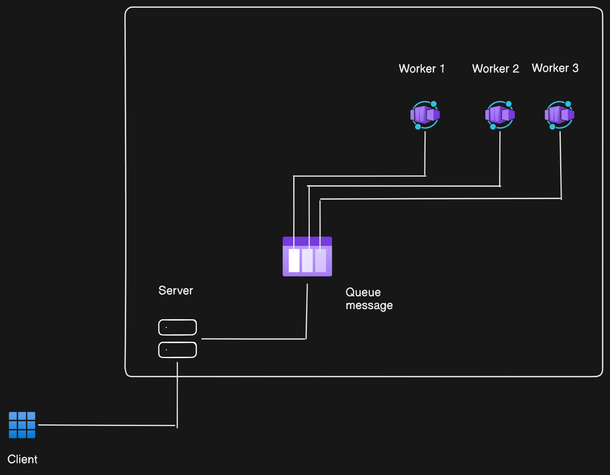

---
runme:
  id: 01JAD7PY4BHTWSPC3XQ3HH0MC7
  version: v3
---

### Queues

### Pub subs

### Redis

## Redis Overview

**Redis** is an open-source, in-memory data structure store, used as a **database**, **cache**, and **message broker**.

One of the key features of Redis is its ability to keep all data in memory, which allows for **high performance** and **low latency access** to data.



## Redis Overview

**Redis** is an open-source, in-memory data structure store, used as a **database**, **cache**, and **message broker**.

One of the key features of Redis is its ability to keep all data in memory, which allows for **high performance** and **low latency access** to data.

## Starting Redis Locally

Let’s start Redis locally and begin using it as a database.

### Starting Redis with Docker

```bash
docker run --name my-redis -d -p 6379:6379 redis

Connecting to Your Container
````bash
docker exec -it container_id /bin/bash

Connecting to the Redis CLI


```bash
docker exec -it my-redis redis-cli

### Redis as a Database
### SET/GET/DEL Commands

Setting Data

```bash
SET mykey "Hello"

Getting Data
````bash
GET mykey

Deleting Data

````bash
DEL mykey

### HSET/HGET/HDEL (Hashes)
Setting Data in a Hash
````bash

HSET user:100 name "John Doe" email "user@example.com" age "30"

Getting Data from a Hash
````bash

HGET user:100 name
HGET user:100 email


## Redis as a Database

### SET/GET/DEL Commands

#### Setting Data

```bash
SET mykey "Hello"

Getting Data

````bash
GET mykey

Deleting Data

````bash
DEL mykey